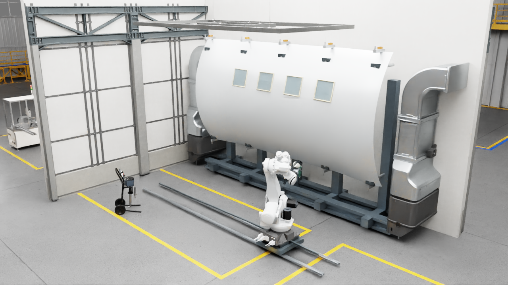

# Aerospace Robotic Painting Digital Twin with NVIDIA Isaac Sim

A portfolio project exploring robotic aircraft-surface painting in Isaac Sim
using a 6-axis robot and auxiliary linear axis, surface-normal-aware path
planning, stand-off control concepts, spray-cone visualization, and geometric
coverage evaluation.



## Motivation

Traditional OLP tools such as RoboDK and DELMIA are mature solutions for
CAD-based robot path generation, reachability, cycle-time analysis, and
production robot programming.

This project explores a complementary question: how can a surface-process
workflow be represented inside an OpenUSD/Isaac Sim environment so that robot
motion, auxiliary axes, sensors, geometry, process metrics, synthetic data, and
future Physical AI workflows can share the same simulation scene?

## Implemented scope

- Rail-positioned 6-axis industrial robot motion
- Generic curved aircraft surface and holding fixture
- Surface sampling with finite-difference normals
- Surface-normal-aware tool-axis construction
- Configurable stand-off and boustrophedon TCP path
- Spray-cone geometry and on/off process visualization
- Distance/angle-based geometric coverage accumulation
- Progressive coverage overlay and summary metrics

[Watch the reviewed demo video](media/demo.mp4) or inspect the final
[coverage view](media/coverage.png).

## Technical boundary

This project models robot/auxiliary-axis motion, tool orientation,
stand-off distance, spray-cone geometry, and geometric surface coverage.

It does NOT simulate or validate paint atomization, droplet deposition,
airflow CFD, solvent evaporation, curing, or physical film thickness.

It is a research/portfolio implementation, not a production-qualified OLP
system and not a replacement for RoboDK or DELMIA.

## Portable coverage demo

The process math runs in ordinary Python without Isaac Sim:

```bash
python -m venv .venv
.venv/Scripts/python -m pip install -e ".[test]"
.venv/Scripts/python scripts/run_demo.py
.venv/Scripts/python -m pytest
```

On Linux/macOS, activate the environment with the platform-specific equivalent.
The report is written to `outputs/coverage_metrics.json`.

## Isaac Sim scene

The local scene composes official NVIDIA assets by reference and uses generic
project-owned aircraft geometry. Raw NVIDIA assets and the machine-specific
generated USD are intentionally not committed. See [the scene composition
contract](scenes/README.md) and [asset provenance](docs/asset_provenance.md).

## Documentation

- [Architecture](docs/architecture.md)
- [Fidelity boundary](docs/fidelity_boundary.md)
- [Relationship to mature OLP tools](docs/olp_comparison.md)
- [Asset provenance](docs/asset_provenance.md)
- [Air-assisted spray architecture](docs/air_assisted_spray_architecture.md)
- [Spray solver decision](docs/spray_solver_decision.md)
- [Research basis](docs/research_basis_air_assisted_spray.md)
- [Spray fidelity boundary](docs/spray_fidelity_boundary.md)
- [External solver licensing](docs/external_solver_license.md)

## Media status

The stills and video are reviewed portfolio captures of the local Isaac Sim
prototype. They demonstrate kinematic/process visualization and geometric
coverage progression. They are not evidence of calibrated paint deposition or
production performance.

## License

Original source code and documentation are licensed under Apache-2.0. Third-party
assets are not included and are not relicensed by this repository. Rendered
media retains the provenance notes in `docs/asset_provenance.md`.
