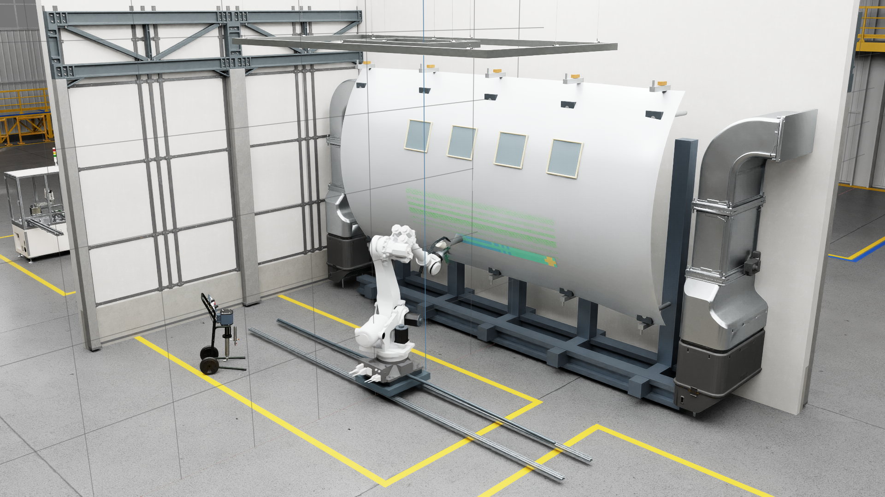

# Aerospace Robotic Painting Digital Twin with Isaac Sim, OpenFOAM, and NVIDIA Warp

This portfolio project connects robot motion, CFD reference data, a fast
deposition surrogate, and GPU droplet transport in one aerospace painting
digital-twin workflow.  Native Isaac Sim provides the moving robot, scene, and
process view; OpenFOAM v2606 supplies the offline reference; S2 and Warp make
the validated process layers usable at runtime.



*Native Isaac Sim scene with the actual robot/TCP motion, active Warp plume,
and the S2 deposition overlay.*

[Watch the 24-second native W2 demo](media/air_assisted_spray/isaac_warp_plume_demo.mp4)
or inspect the [W2 deposition view](media/air_assisted_spray/isaac_warp_plume_deposition.png).

## What the release candidate demonstrates

- A composed OpenUSD/Isaac Sim painting cell with a rail-mounted 6-axis robot,
  process tool, spray tool, aircraft panel, and live TCP-driven motion.
- OpenFOAM v2606 flat-plate reference cases at 0°, 7.5°, 10°, and 15° for
  carrier flow and wall-deposition evidence.
- S2, a CFD-calibrated fast deposition surrogate validated on the held-out
  7.5° case.
- W1.3, a fixed-grid full-vector carrier surrogate validated on a blind 10°
  case, and W2, an optional native Isaac Sim Warp Lagrangian plume layer.

## Fidelity architecture

| Layer | Role | Runtime authority |
|---|---|---|
| OpenFOAM v2606 | Offline reference/teacher CFD for carrier flow and deposition maps | Reference evidence |
| S2 | CFD-calibrated fast deposition surrogate | Authoritative deposition and surface mass map |
| NVIDIA Warp W1.3 | Validated fixed-grid full-vector carrier plus Lagrangian droplets | Optional higher-fidelity transport/plume layer |
| Isaac Sim | Robot, scene, process integration, and visualization | Actual moving scene and presentation |

S2 remains the authoritative fast deposition layer.  Warp adds transport and
plume context; it does not replace the S2 surface deposition overlay.

## Validation highlights

The values below are read from the checked-in JSON evidence:

| Checkpoint | Measured result |
|---|---|
| S2 7.5° hold-out | Centroid distance **0.403 mm**, field correlation **0.93065**, field NRMSE **0.03316** |
| Warp W1.3 blind 10° hold-out | Carrier normalized vector RMSE **0.02580**, carrier correlation **0.99950**; deposition centroid error **1.585 mm**, correlation **0.95043**, NRMSE **0.02581** |
| Native W2 runtime | **225** Warp batches, **2,500** parcels/batch, Warp mass-ledger residual **5.21e-18 kg**, S2 surface-map closure **1.95e-18 kg** |

Evidence: [S2 hold-out](results/air_assisted/s2/holdout_validation.json),
[W1.3 validation](results/air_assisted/warp_w1_3/validation_summary.json), and
[native W2 metrics](results/air_assisted/isaac_warp_runtime/runtime_metrics.json).

## What is computed in the native viewer

- The robot and TCP follow the actual Isaac Sim scene motion.
- Carrier velocity is interpolated from the validated W1.3 full-vector
  OpenFOAM-anchor model.
- Droplets follow actual Warp Lagrangian trajectories with drag, gravity, and
  mesh-collision handling.
- Plume points are the active computational positions, enlarged only for
  visibility.
- The surface overlay is the S2 CFD-calibrated deposited-mass density map.

The moving-scene Warp transport uses a quasi-steady local tangent-patch
approximation.  The W2 metrics record transport and ledger behavior; projected
Warp deposition is not used as the authoritative surface overlay.

## Fidelity boundary

This project does not claim primary atomization, breakup, evaporation,
stochastic turbulent dispersion, splash/rebound, wall-film transport, curing,
physical film thickness, or production coating quality.  Deposited mass and
normalized deposited-mass density are not paint thickness.  See the canonical
[spray fidelity boundary](docs/spray_fidelity_boundary.md).

## Relationship to offline programming

Traditional OLP tools such as RoboDK and DELMIA remain the right comparison
for CAD-to-path generation, reachability, collision checking, cycle-time
analysis, and controller post-processing.  This project is complementary: it
keeps the robot, scene, process model, CFD-derived evaluation, and GPU plume in
one programmable Isaac Sim/OpenUSD environment.  See the
[OLP comparison](docs/olp_comparison.md).

## Supporting media and portable demo

The earlier [native S2 runtime hero](media/air_assisted_spray/isaac_s2_runtime_hero.png),
[S2 deposition view](media/air_assisted_spray/isaac_s2_runtime_deposition.png),
and [S2 runtime video](media/air_assisted_spray/isaac_s2_runtime_demo.mp4)
remain supporting evidence.  The [W1.3 fidelity hierarchy](media/air_assisted_spray/warp_w1_3_fidelity_hierarchy.png)
shows the measured comparison between OpenFOAM, S2, and the Warp transport
checkpoints.

The process math also runs without Isaac Sim:

```bash
python -m venv .venv
.venv/Scripts/python -m pip install -e ".[test]"
.venv/Scripts/python -m pytest
```

The original geometric coverage demo remains available through
`scripts/run_demo.py`; its report is written to `outputs/coverage_metrics.json`.

## Scene and asset provenance

The local scene composes official NVIDIA assets by reference and uses generic
project-owned aircraft geometry.  Raw NVIDIA assets and machine-specific USD
files are intentionally not committed.  See the
[scene composition contract](scenes/README.md) and
[asset provenance](docs/asset_provenance.md).

## Documentation

- [Architecture](docs/air_assisted_spray_architecture.md)
- [Spray fidelity boundary](docs/spray_fidelity_boundary.md)
- [Relationship to mature OLP tools](docs/olp_comparison.md)
- [OpenFOAM reference workflow](reference_cfd/README.md)
- [Asset provenance](docs/asset_provenance.md)

## License

Original source code and documentation are licensed under Apache-2.0.
Third-party assets are not included and are not relicensed by this repository.
Rendered media retains the provenance notes in `docs/asset_provenance.md`.
