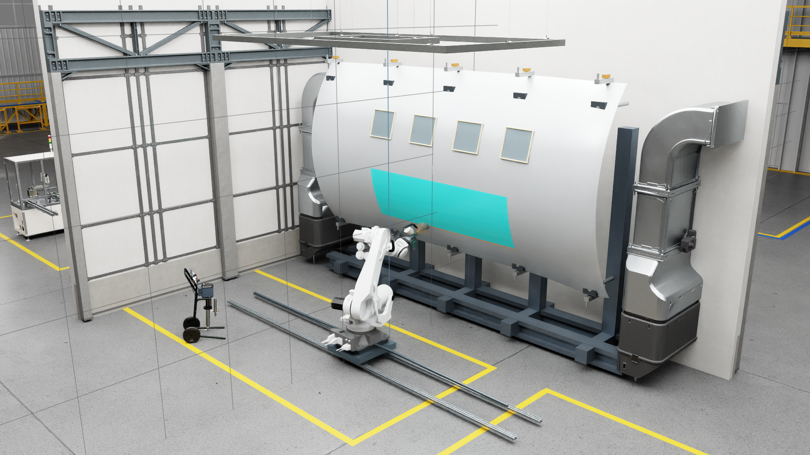

# Aerospace Robotic Painting Digital Twin with Isaac Sim, OpenFOAM, and NVIDIA Warp

A full-panel robotic painting digital twin combining OpenFOAM-referenced
process modeling, CFD-calibrated S2 deposition, GPU Warp droplet transport,
native Isaac Sim robot/process execution, and surface-wide estimated wet-film
thickness.

## Full-panel release



*Public hero: the native Isaac Sim full-panel process, active Warp transport
view, and surface-wide estimated WFT overlay.*

[Watch the synchronized spray-analysis demo](media/air_assisted_spray/isaac_spray_analysis_demo.mp4),
or inspect the [final full-panel WFT view](media/air_assisted_spray/isaac_full_panel_film_final.png).
The earlier full-panel film demo remains supporting process evidence.

## CFD flow visualization

The 7.5° OpenFOAM reference velocity field is compacted into a structured
[vector artifact](models/openfoam_flow_field_7p5deg_v1.json) and mapped into
the current local process frame in Isaac Sim.  Velocity vectors, a magnitude
slice, and streamlines are shown for interpretation; the CFD solve remains
offline.  The local mapping is quasi-steady: the solved field is rigidly
remapped into the current tangent frame rather than solved around the moving
aircraft.

Public sequence: **PROCESS FRAME → CFD FLOW FIELD → WARP DROPLETS →
FULL-PANEL PAINTING → ESTIMATED WFT**.

- [CFD flow field still](media/air_assisted_spray/isaac_cfd_flow_field.png)
- [CFD + Warp combined still](media/air_assisted_spray/isaac_cfd_warp_combined.png)
- [CFD velocity slice still](media/air_assisted_spray/isaac_cfd_flow_slice.png)
- [Earlier static CFD flow demo (supporting)](media/air_assisted_spray/isaac_full_panel_cfd_flow_demo.mp4)

## Synchronized spray analysis

The canonical analysis view keeps the offline OpenFOAM reference flow, actual
Warp particle positions, hit/impact markers, and the live S2 deposited-mass /
Estimated WFT overlay on one simulated timeline.  During this technical view
the visual-only `WarpSprayPlumeGuide` is OFF; the displayed particles and short
trails come from recorded Warp positions and mesh-hit events.  S2 remains the
authoritative thickness layer, while the Warp hit map is diagnostic only.

The CFD direction gate reports a mean axial velocity of `12.7113 m/s`, a
`0.0215–18.0025 m/s` axial range, and `100%` positive axial samples in the
clipped nozzle-to-panel ROI.  The analysis view uses 80 sparse vectors, 20
streamlines, 120 short-lived impact markers, and a bounded 160-segment trail
view for readability.

- [Synchronized spray-analysis close-up](media/air_assisted_spray/isaac_spray_analysis_closeup.png)
- [Synchronized CFD + Warp combined still](media/air_assisted_spray/isaac_spray_analysis_combined.png)
- [Progressive S2 WFT still](media/air_assisted_spray/isaac_progressive_wft.png)
- [Synchronized spray-analysis demo — 85 s, H.264, 1920×1080, 30 fps](media/air_assisted_spray/isaac_spray_analysis_demo.mp4)

## Synchronized spray analysis

The canonical analysis view keeps the offline OpenFOAM reference flow, actual
Warp particle positions, hit/impact markers, and the live S2 deposited-mass /
Estimated WFT overlay on one simulated timeline.  During this technical view
the visual-only `WarpSprayPlumeGuide` is OFF; the displayed particles and short
trails come from recorded Warp positions and mesh-hit events.  S2 remains the
authoritative thickness layer, while the Warp hit map is diagnostic only.

The CFD direction gate reports a mean axial velocity of `12.7113 m/s`, a
`0.0215–18.0025 m/s` axial range, and `100%` positive axial samples in the
clipped nozzle-to-panel ROI.  The analysis view uses 80 sparse vectors, 20
streamlines, 120 short-lived impact markers, and a bounded 160-segment trail
view for readability.

- [Synchronized spray-analysis close-up](media/air_assisted_spray/isaac_spray_analysis_closeup.png)
- [Synchronized CFD + Warp combined still](media/air_assisted_spray/isaac_spray_analysis_combined.png)
- [Progressive S2 WFT still](media/air_assisted_spray/isaac_progressive_wft.png)
- [Synchronized spray-analysis demo — 85 s, H.264, 1920×1080, 30 fps](media/air_assisted_spray/isaac_spray_analysis_demo.mp4)

## What the release candidate demonstrates

- A composed OpenUSD/Isaac Sim painting cell with a rail-mounted 6-axis robot,
  process tool, spray tool, aircraft panel, and live TCP-driven motion.
- OpenFOAM v2606 flat-plate reference cases at 0°, 7.5°, 10°, and 15° for
  carrier flow and wall-deposition evidence.
- S2, a CFD-calibrated fast deposition surrogate validated on the held-out
  7.5° case.
- W1.3, a fixed-grid full-vector carrier surrogate validated on a blind 10°
  case, and W2, an optional native Isaac Sim Warp Lagrangian plume layer.

## Fidelity architecture

| Layer | Role | Runtime authority |
|---|---|---|
| OpenFOAM v2606 | Offline reference/teacher CFD for carrier flow and deposition maps | Reference evidence |
| S2 | CFD-calibrated fast deposition surrogate | Authoritative deposition and surface mass map |
| NVIDIA Warp W1.3 | Validated fixed-grid full-vector carrier plus Lagrangian droplets | Optional higher-fidelity transport/plume layer |
| Isaac Sim | Robot, scene, process integration, and visualization | Actual moving scene and presentation |

S2 remains the authoritative fast deposition layer.  Warp adds transport and
plume context; it does not replace the S2 surface deposition overlay.

## Validation highlights

The compact release table below uses the checked-in validation artifacts:

| Layer | Result |
|---|---|
| S2 7.5° hold-out | Centroid error **0.403 mm**, correlation **0.93065**, NRMSE **0.03316** |
| Warp W1.3 blind 10° | Carrier NRMSE **0.02580**, carrier correlation **0.99950**, deposition centroid **1.585 mm** |
| Full-panel process | **28 passes** over **2.8466 m²** |
| Estimated WFT | Mean **3.649 µm**, P05–P95 **2.121–3.903 µm**, CV **12.6%** |
| Native Warp runtime | **1,722 batches × 2,500 parcels = 4,305,000 computational parcel histories** |
| Mass accounting | Full-panel combined residual **~8.88e-16 kg** |

Evidence: [full-panel metrics](results/air_assisted/full_panel_film/full_panel_metrics.json),
[full-panel plan](results/air_assisted/full_panel_film/full_panel_plan.json),
[S2 hold-out](results/air_assisted/s2/holdout_validation.json), and
[W1.3 validation](results/air_assisted/warp_w1_3/validation_summary.json).

## Full-panel process and estimated WFT

The native process executes 28 passes over a `2.846638288 m²` panel.  Estimated
WFT is computed as:

`Estimated WFT = deposited mass / (surface area × configured liquid density)`

Estimated WFT is model-derived, not measured.  The committed full-panel result
has mean `3.649458 µm`, P05 `2.120723 µm`, P95 `3.903405 µm`, maximum
`3.907579 µm`, standard deviation `0.459557 µm`, CV `12.5925%`, and
`94.5946%` of area within ±20% of the predicted mean.

DFT is secondary: **Illustrative DFT estimate**, assumed volume solids = 50%,
`synthetic_demo_only`.  The illustrative mean `1.824729 µm` is not validated
aircraft coating thickness.

## What is computed in the native viewer

- The robot and TCP follow the actual Isaac Sim scene motion.
- Carrier velocity is interpolated from the validated W1.3 full-vector
  OpenFOAM-anchor model.
- Droplets follow actual Warp Lagrangian trajectories with drag, gravity, and
  mesh-collision handling.
- The surface overlay is the S2 CFD-calibrated deposited-mass density map.

The native viewer renders actual live Warp particle positions and also uses a
visual-only plume guide to keep the sub-pixel transport readable in the final
1080p capture.  The guide does not affect transport, deposition, forces, or
mass accounting.  The actual positions are at
`/World/AerospacePaintingCell/WarpSprayPlume`; the guide is
`/World/AerospacePaintingCell/WarpSprayPlumeGuide` with `adds_mass = false`,
`adds_deposition = false`, and `visual_only = true`.  The visible orange plume
is therefore a composite presentation, and not every visible orange point is a
physical Warp parcel.

The moving-scene Warp transport is quasi-steady local tangent-patch transport,
not online CFD.  The S2 surface deposition overlay remains authoritative.

## Fidelity boundary

This project does not validate primary atomization, breakup, evaporation,
stochastic turbulence, splash/rebound, wall-film transport, sagging, curing,
physical film thickness measurement, production coating quality, or production
qualification.  See the canonical [spray fidelity boundary](docs/spray_fidelity_boundary.md).

## Relationship to offline programming

Traditional OLP tools such as RoboDK and DELMIA remain the right comparison
for CAD-to-path generation, reachability, collision checking, cycle-time
analysis, and controller post-processing.  This project is complementary: it
keeps the robot, scene, process model, CFD-derived evaluation, and GPU plume in
one programmable Isaac Sim/OpenUSD environment.  See the
[OLP comparison](docs/olp_comparison.md).

## Supporting media and portable demo

The full-panel files above are the public hero, demo, and final capture.  The
earlier [native W2 runtime hero](media/air_assisted_spray/isaac_warp_plume_hero.png),
[W2 deposition view](media/air_assisted_spray/isaac_warp_plume_deposition.png),
and [W2 runtime video](media/air_assisted_spray/isaac_warp_plume_demo.mp4) remain
supporting and historical evidence.  The earlier [native S2 runtime hero](media/air_assisted_spray/isaac_s2_runtime_hero.png),
[S2 deposition view](media/air_assisted_spray/isaac_s2_runtime_deposition.png),
and [S2 runtime video](media/air_assisted_spray/isaac_s2_runtime_demo.mp4)
also remain supporting evidence.  The [W1.3 fidelity hierarchy](media/air_assisted_spray/warp_w1_3_fidelity_hierarchy.png)
shows the measured comparison between OpenFOAM, S2, and the Warp transport
checkpoints.

The process math also runs without Isaac Sim:

```bash
python -m venv .venv
.venv/Scripts/python -m pip install -e ".[test]"
.venv/Scripts/python -m pytest
```

The original geometric coverage demo remains available through
`scripts/run_demo.py`; its report is written to `outputs/coverage_metrics.json`.

## Release status

`SYNCHRONIZED_SPRAY_ANALYSIS_VALIDATED`

The CFD field is solved offline in OpenFOAM v2606 and visualized in the
current local tangent process frame; Isaac Sim is not an online CFD solver.
Actual Warp droplet positions, impact events, and progressive S2 WFT are
shown together during the native process run.

Next action: use the synchronized spray-analysis video as the final portfolio
demo.  No additional spray-physics checkpoint is required before publication.

## Scene and asset provenance

The local scene composes official NVIDIA assets by reference and uses generic
project-owned aircraft geometry.  Raw NVIDIA assets and machine-specific USD
files are intentionally not committed.  See the
[scene composition contract](scenes/README.md) and
[asset provenance](docs/asset_provenance.md).

## Documentation

- [Architecture](docs/air_assisted_spray_architecture.md)
- [Spray fidelity boundary](docs/spray_fidelity_boundary.md)
- [Relationship to mature OLP tools](docs/olp_comparison.md)
- [OpenFOAM reference workflow](reference_cfd/README.md)
- [Asset provenance](docs/asset_provenance.md)

## License

Original source code and documentation are licensed under Apache-2.0.
Third-party assets are not included and are not relicensed by this repository.
Rendered media retains the provenance notes in `docs/asset_provenance.md`.
